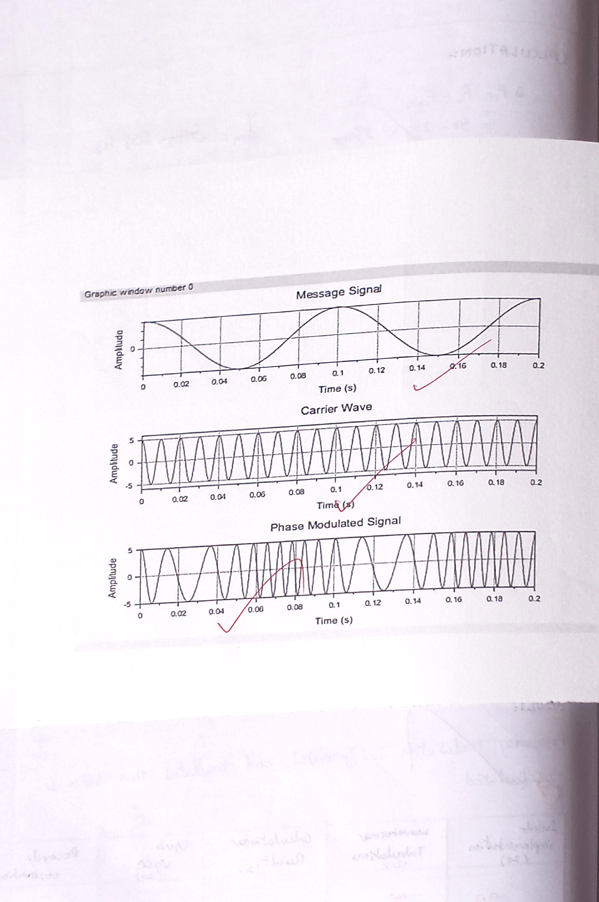
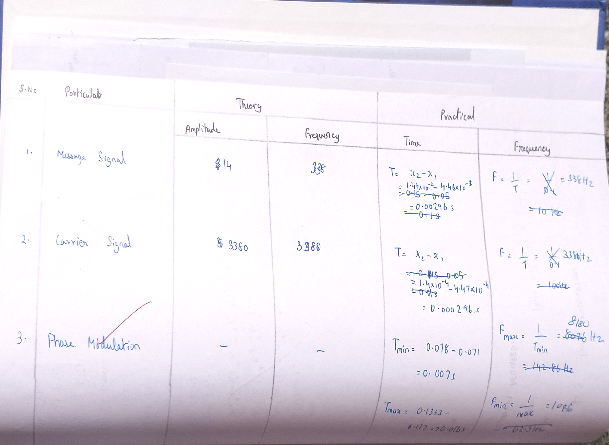
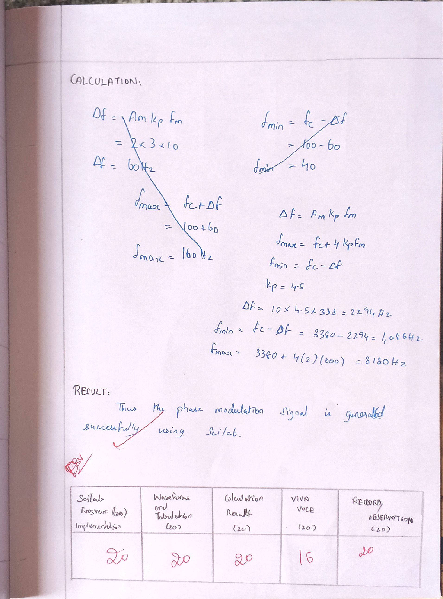

# SIMULATION-OF-MEAN-AND-VARIANCE-USING-SCILAB-T1-M4-ODD
# EXPERIMENT 5: SIMULATION OF PHASE MODULATION / MEAN AND VARIANCE USING SCILAB

## AIM

To generate and simulate phase modulation in SCILAB and calculate its parameters.


---

## EQUIPMENTS NEEDED

* Computer with i3 Processor
* SCILAB

---

## ALGORITHM

1. **Define Parameters:**
   * Carrier amplitude ($A_c$), modulating signal amplitude ($A_m$).
   * Carrier frequency ($f_c$), modulating frequency ($f_m$).
   * Sampling frequency ($f_s$), phase sensitivity ($k_p$).
   * Time duration vector $t$.

2. **Generate Modulating Signal:**
   * Compute message signal $m(t) = A_m \cos(2\pi f_m t)$.

3. **Generate Carrier Signal:**
   * Compute carrier signal $c(t) = A_c \cos(2\pi f_c t)$.

4. **Compute Phase Modulated Signal:**
   * Compute $pm(t) = A_c \cos(2\pi f_c t + k_p m(t))$.

5. **Plot Signals:**
   * Use `subplot` and `plot` to visualize the modulating signal, carrier wave, and phase modulated signal.

6. **Calculate Output Parameters:**
   * Determine frequency deviation $\Delta f$, minimum frequency $f_{min}$, and maximum frequency $f_{max}$.

---

## PROCEDURE

* Refer to the algorithm and write the code for the experiment.
* Open SCILAB in the system.
* Type your code in the New Editor.
* Save the file.
* Execute the code.
* If any error occurs, correct it in the code and execute again.
* Verify the generated results, waveforms, and tabulation.

---

## PROGRAM / CODE

```scilab
clc;
clear;
clf;

Ac = 5;
Am = 3;
fc = 100;
Fm = 10;
kp = 2;
fs = 5000;
t = 0:1/fs:0.2;

m = Am * cos(2 * %pi * Fm * t);
c = Ac * cos(2 * %pi * fc * t);
pm = Ac * cos(2 * %pi * fc * t + kp * m);

subplot(3, 1, 1);
plot(t, m);
title("Message Signal");

subplot(3, 1, 2);
plot(t, c);
title("Carrier Signal");

subplot(3, 1, 3);
plot(t, pm);
title("Phase Modulated Signal");
```


---

## MODEL GRAPHS / SCILAB OUTPUT

**Simulation Output Waveforms:**



---

## TABULATION

| S.No | Particulars | Amplitude (V) Theory | Frequency (Hz) Theory | Time (s) Practical | Frequency (Hz) Practical |
| :---: | :--- | :---: | :---: | :--- | :--- |
| 1 | Message Signal | 3 | 10 | $T = x_2 - x_1 = 1.49 \times 10^{-2} - 4.46 \times 10^{-3} = 0.00296\text{ s} \approx 0.1\text{ s}$ | $F = \frac{1}{T} = 10\text{ Hz}$ |
| 2 | Carrier Signal | 5 | 100 | $T = x_2 - x_1 = 1.4 \times 10^{-4} - 4.47 \times 10^{-4} = 0.000296\text{ s}$ | $F = \frac{1}{T} = 100\text{ Hz}$ |
| 3 | Phase Modulation | - | - | $T_{min} = 0.078 - 0.071 = 0.007\text{ s}$<br>$T_{max} = 0.1333 - 0.117 = 0.0163\text{ s}$ | $F_{max} = \frac{1}{T_{min}} = 142.86\text{ Hz}$<br>$F_{min} = \frac{1}{T_{max}} = 62.5\text{ Hz}$ |



---

## CALCULATIONS

$$\Delta f = A_m \cdot k_p \cdot f_m = 3 \times 2 \times 10 = 60\text{ Hz}$$

$$f_{min} = f_c - \Delta f = 100 - 60 = 40\text{ Hz}$$

$$f_{max} = f_c + \Delta f = 100 + 60 = 160\text{ Hz}$$



---

## RESULT

Thus, the phase modulation signal is generated and simulated successfully using SCILAB, and the output parameters (frequency deviation, maximum and minimum frequencies) are verified.


